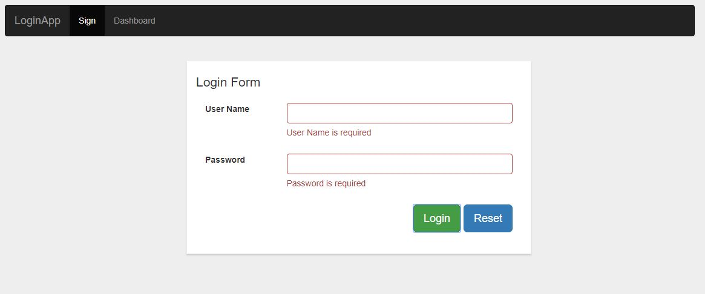

# Angular login with Authentication & Form Validation
Login Page App based on angular 6.


## Demo
You may want to have a look at the demo https://vgupta1192.github.io/login-app/

## Adding the component in your project
```
<app-login-root></app-login-root>
```
### Dependencies
```
npm install jquery --save
npm install bootstrap --save
```
### Login Credentials
```
User Name: admin
Password : admin123
```
### Services
```
The service call for logging out the admin and removing the token.

1. auth.service.ts
```
### auth.service.ts
``` typescript
import { Injectable } from '@angular/core';

@Injectable({
  providedIn: 'root'
})
export class AuthService {

  constructor() { }

  logout(): void {
    localStorage.setItem('isLoggedIn', 'false');
    localStorage.removeItem('token');
  }
}
```
### app.component.html
``` html
<!--The content below is only a placeholder and can be replaced.-->
<div class="container">
 
  <!-- Static navbar -->
  <nav class="navbar navbar-inverse">
      <div class="container-fluid">
        <div class="navbar-header">
          <button type="button" class="navbar-toggle collapsed" data-toggle="collapse" data-target="#navbar" aria-expanded="false" aria-controls="navbar">
            <span class="sr-only">Toggle navigation</span>
            <span class="icon-bar"></span>
            <span class="icon-bar"></span>
            <span class="icon-bar"></span>
          </button>
          <a class="navbar-brand" href="#">LoginApp</a>
        </div>
        <div id="navbar" class="navbar-collapse collapse">
          <ul class="nav navbar-nav">
            <li routerLinkActive="active"><a routerLink="/login">Sign</a></li>
            <li routerLinkActive="active"><a routerLink="/dashboard">Dashboard</a></li>
          </ul>
        </div><!--/.nav-collapse -->
      </div><!--/.container-fluid -->
    </nav>

 <router-outlet></router-outlet>
</div>
```
### app.component.ts
``` typescript
import { Component } from '@angular/core';

@Component({
  selector: 'app-login-root',
  templateUrl: './app.component.html',
  styleUrls: ['./app.component.css']
})
export class AppComponent {
}
```

### app.module.ts
```
import { BrowserModule } from '@angular/platform-browser';
import { NgModule } from '@angular/core';
import { RouterModule, Routes } from '@angular/router';
import { AuthGuard } from './auth.guard';
import { FormsModule, ReactiveFormsModule } from '@angular/forms';

import { AppComponent } from './app.component';
import { LoginComponent } from './login/login.component';
import { DashboardComponent } from './dashboard/dashboard.component';


const appRoutes: Routes = [
  { path: '', component: LoginComponent },
  { path: 'login', component: LoginComponent },
  { path: 'dashboard', component: DashboardComponent, canActivate: [AuthGuard] }
];

@NgModule({
  declarations: [
    AppComponent,
    LoginComponent,
    DashboardComponent
  ],
  imports: [
    BrowserModule,
    FormsModule,
    ReactiveFormsModule,
    RouterModule.forRoot(appRoutes)
  ],
  providers: [AuthGuard],
  bootstrap: [AppComponent]
})
export class AppModule { }

```
### login.component.ts
``` typescript
import { Component, OnInit } from '@angular/core';
import { FormBuilder, FormGroup, Validators } from '@angular/forms';
import { Router } from '@angular/router';
import { Login } from '../login';
import { AuthService } from '../auth.service';

@Component({
  selector: 'app-login',
  templateUrl: './login.component.html',
  styleUrls: ['./login.component.css']
})
export class LoginComponent implements OnInit {

  model: Login = { userid: 'admin', password: 'admin123' };
  loginForm: FormGroup;
  message: string;
  returnUrl: string;
  submitted: boolean;
  loading: boolean;

  constructor(private formBuilder: FormBuilder, private router: Router, public authService: AuthService) { }

  ngOnInit() {
    this.submitted = false;
    this.loading = false;
    this.loginForm = this.formBuilder.group({
      userid: ['', Validators.required],
      password: ['', Validators.required]
    });
    this.returnUrl = '/dashboard';
    this.authService.logout();
  }

  // convenience getter for easy access to form fields
  get f() { return this.loginForm.controls; }

  login() {
    this.submitted = true;
    this.loading = true;
    // stop here if form is invalid
    if (this.loginForm.invalid) {
      return;
    } else {
      if (this.f.userid.value === this.model.userid && this.f.password.value === this.model.password) {
        localStorage.setItem('isLoggedIn', 'true');
        localStorage.setItem('token', this.f.userid.value);
        this.router.navigate([this.returnUrl]);
      } else {
        this.loading = false;
        this.message = 'Please check your userid and password';
      }
    }
  }
  reset() {
    this.loginForm.reset();
  }
}
```
### login.component.html
``` html
<div class="container">
    <div class="col-md-6 col-md-offset-3 loginDialog">
        <p class="lead">Login Form</p>
        <p *ngIf="message" class="text-center error">{{message}}</p>
      <form [formGroup]="loginForm" (ngSubmit)="login()">
          <div class="form-group clearfix" [ngClass]="{ 'has-error': submitted && f.userid.errors }">
              <label for="userid" class="col-md-3 col-sm-5 col-xs-12">User Name</label>
              <div class="col-md-9 col-sm-7 col-xs-12">
                  <input type="text" class="form-control" formControlName="userid" />
                  <div *ngIf="submitted && f.userid.errors" class="help-block">
                        <div *ngIf="f.userid.errors.required">User Name is required</div>
                  </div>
              </div>
          </div>
          <div class="form-group clearfix" [ngClass]="{ 'has-error': submitted && f.password.errors }">
            <label for="password" class="col-md-3 col-sm-5 col-xs-12">Password</label>
            <div class="col-md-9 col-sm-7 col-xs-12">
                <input type="password" class="form-control" formControlName="password"/>
                <div *ngIf="submitted && f.password.errors" class="help-block">
                        <div *ngIf="f.password.errors.required">Password is required</div>
                </div>
            </div>
          </div>
          <div class="col-xs-12 form-group text-right">
            <button class="btn btn-success btn-lg" type="submit">Login</button>
            <button class="btn btn-primary btn-lg resetMargin" type="submit" (click)="reset()">Reset</button>
          </div>
      </form>
    </div>
</div>
```
### auth.guard.ts
``` typescript
import { Injectable } from '@angular/core';
import { CanActivate, CanActivateChild, Router, ActivatedRouteSnapshot, RouterStateSnapshot } from '@angular/router';

@Injectable()
export class AuthGuard implements CanActivate {


    constructor(private router: Router) { }

    canActivate(route: ActivatedRouteSnapshot, state: RouterStateSnapshot): boolean {
        const url: string = state.url;
        return this.verifyLogin(url);
    }

    verifyLogin(url): boolean {
        if (!this.isLoggedIn()) {
            this.router.navigate(['/login']);
            return false;
        } else if (this.isLoggedIn()) {
            return true;
        }
    }
    public isLoggedIn(): boolean {
        let status = false;
        if (localStorage.getItem('isLoggedIn') === 'true') {
            status = true;
        } else {
            status = false;
        }
        return status;
    }
}
```
### login.ts
``` typescript
export class Login {
    userid: string;
    password: string;
}
```
### dashboard.component.ts
``` typescript
import { Component, OnInit } from '@angular/core';
import { AuthService } from '../auth.service';
import { Router } from '@angular/router';

@Component({
  selector: 'app-dashboard',
  templateUrl: './dashboard.component.html',
  styleUrls: ['./dashboard.component.css']
})
export class DashboardComponent implements OnInit {

  id: string;
  constructor(private router: Router, public authService: AuthService) { }

  ngOnInit() {
    this.id = localStorage.getItem('token');
  }

  logout(): void {
    this.authService.logout();
    this.router.navigate(['/login']);
  }
}
```
### dashboard.component.html
``` html
<div class="container">
    <div class="col-md-6 col-md-offset-3 loginDialog">
        Welcome,  {{id}}
        <a href="javascript:void(0);" (click)="logout()">Logout</a>
    </div>
</div>
```
